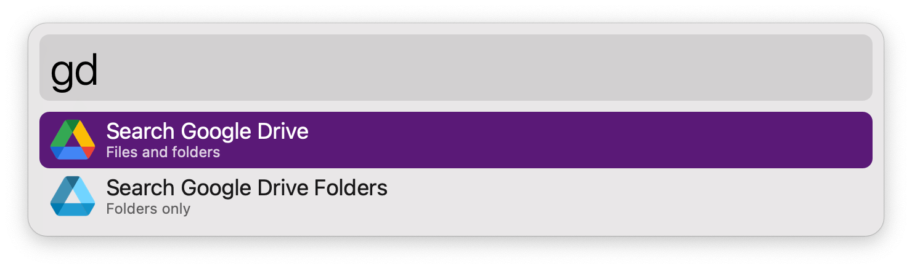
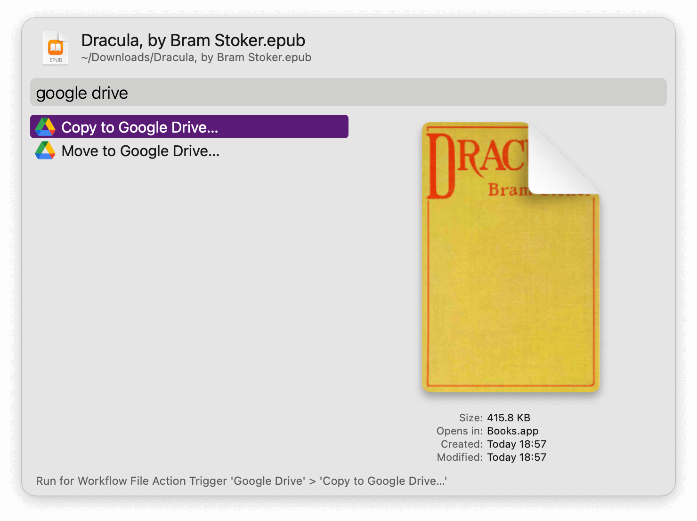

#  Google Drive Alfred Workflow

List File Stream contents from Google Drive

<a href='https://github.com/alfredapp/google-drive-workflow/releases/latest/download/Google.Drive.alfredworkflow'>⤓ Download Workflow</a>

## About

An interim Workflow to bridge the gap until (if) Google Drive fixes the situation of files not being indexable by Spotlight (and thus Alfred).

Call `gd` and type to filter the contents of your Google Drive. `gdf` limits the search to folders.

↩ opens the path; ⌥↩ reveals it in the Finder; ⇧↩ searches for it on Google Drive’s website.

You’ll be asked to build the cache on your first run. A notification will show when it’s ready. The more files you have, the longer the wait. A macOS launchd agent will be loaded to do it daily and on boot.

To rebuild the cache on demand, run `:gdrebuildcache`.

The File Actions make it straightforward to copy and move files to a Google Drive folder.

To report a problem, run `!gddiagnostic`.

<a href='https://github.com/alfredapp/google-drive-workflow/releases/latest/download/Google.Drive.alfredworkflow'>⤓ Download Workflow</a>
